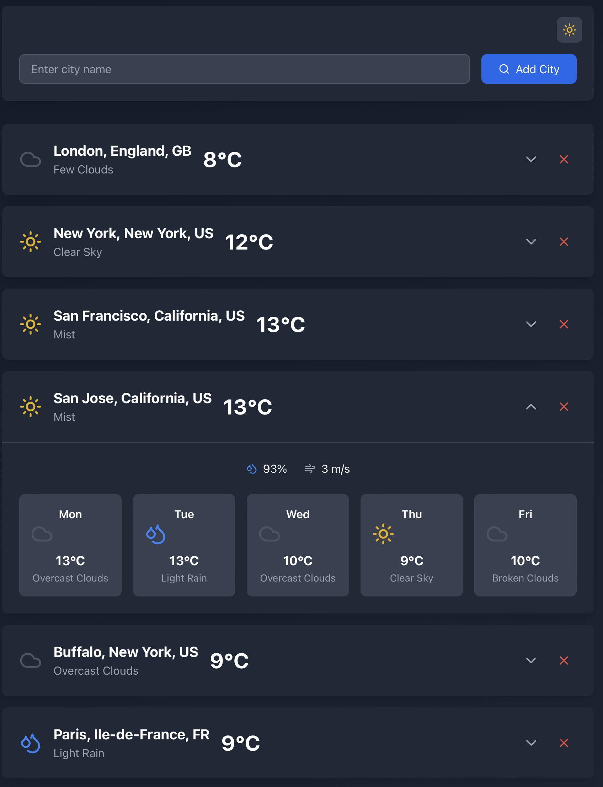

# 🌦️ Weather App

A modern, responsive weather dashboard built with React that allows you to track weather conditions across multiple cities with beautiful visualizations and real-time updates.

## ✨ Features

- 🌍 **Multi-city Tracking**: Add and monitor multiple cities simultaneously
- 🎯 **Real-time Updates**: Get current weather conditions and 5-day forecasts
- 🎨 **Modern UI**: Clean and intuitive interface with smooth animations
- 📱 **Responsive Design**: Works perfectly on both desktop and mobile devices
- 🔄 **Interactive Cards**: Expandable city cards with detailed weather information
- 🌡️ **Comprehensive Data**: Temperature, humidity, wind speed, and more
- 🎭 **Dynamic Icons**: Weather condition-specific icons for better visualization

## 🚀 Live Demo

Check out the live demo: [Weather Dashboard Pro](https://your-demo-link.com)



2. **Install dependencies**
```bash
npm install
```

4. **Start the development server**
```bash
cd weather-app
npm start
```

## 💻 Tech Stack

- ⚛️ **React**: Frontend library
- 🎨 **Tailwind CSS**: Styling
- 📦 **Lucide React**: Icons
- 🌐 **OpenWeather API**: Weather data
- 🔄 **React Hooks**: State management

## 🔧 Configuration

### API Setup

1. Get an API key from [OpenWeather](https://openweathermap.org/api)
2. Add it in the WatherApp.js file
```

### Customization

You can customize various aspects of the app by modifying:

- `tailwind.config.js`: Styling themes
- `src/utils/constants.js`: Default values and configurations
- `src/styles/index.css`: Custom CSS rules

## 📖 Usage

1. **Adding a City**
   - Type the city name in the search bar
   - Press Enter or click the Add City button
   - The city card will appear in your dashboard

2. **Viewing Details**
   - Click on any city card to expand/collapse detailed information
   - View current conditions and 5-day forecast

3. **Removing a City**
   - Click the ❌ icon on any city card to remove it from your dashboard

## 🤝 Contributing

Contributions are welcome! Please follow these steps:

1. Fork the repository
2. Create your feature branch:
```bash
git checkout -b feature/AmazingFeature
```
3. Commit your changes:
```bash
git commit -m '✨ Add some AmazingFeature'
```
4. Push to the branch:
```bash
git push origin feature/AmazingFeature
```
5. Open a Pull Request

## 👏 Acknowledgments

- OpenWeather API for providing weather data
- [Lucide](https://lucide.dev) for beautiful icons
- [Tailwind CSS](https://tailwindcss.com) for styling utilities
- React team for the awesome framework